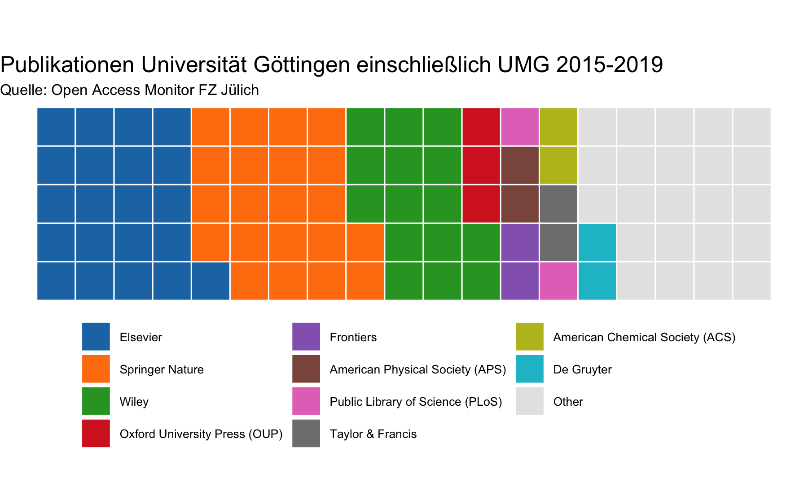
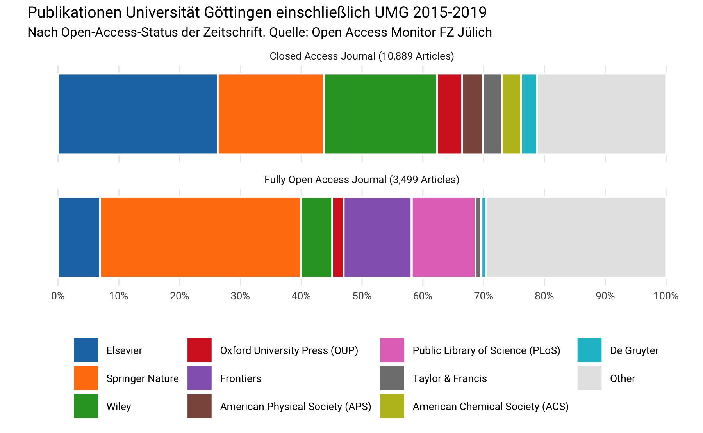

OAM Uni Göttingen
================
Najko Jahn
1/7/2020

## Problem Statement: How to avoid double counting of publications using OAM data?

OAM uses GRID organizatioanl identifier scheme, which distinguished
between Universities and its Hospitals. However, many libraries serve
both institutions. In order to make use of OAM for the preparation of
license negotiation, publication records from both the university and
its hospital needs to be joined into a single dataset. Here, I present
how to avoid double counting when using data from the OAM with R.

## Obtain data from the OAM using the GUI

## Create a union set that removes duplicates

``` r
library(tidyverse)
ugoe <- readr::read_delim("data/oam_ugoe.csv", delim = ";")
umg <- readr::read_delim("data/oam_umg.csv", delim = ";")

union_goe <- dplyr::union(ugoe, umg)
union_goe
#> # A tibble: 14,477 x 7
#>    oaColorName publicationId  year publisherId publisherName journalId
#>    <chr>       <chr>         <dbl> <chr>       <chr>         <chr>    
#>  1 Grün        pub.10000013…  2015 pblshr.100… American Mat… jour.106…
#>  2 Closed      pub.10000087…  2016 pblshr.100… AIP Publishi… jour.107…
#>  3 Gold        pub.10000287…  2016 pblshr.100… American Soc… jour.104…
#>  4 Closed      pub.10000394…  2016 pblshr.100… Elsevier      jour.131…
#>  5 Bronze      pub.10000779…  2017 pblshr.100… Wiley         jour.131…
#>  6 Gold        pub.10000805…  2015 pblshr.100… Springer Nat… jour.104…
#>  7 Gold        pub.10000903…  2016 pblshr.100… eLife         jour.104…
#>  8 Gold        pub.10000938…  2016 pblshr.100… Springer Nat… jour.104…
#>  9 Closed      pub.10001056…  2016 pblshr.100… Elsevier      jour.113…
#> 10 Closed      pub.10001088…  2016 pblshr.100… Wiley         jour.105…
#> # … with 14,467 more rows, and 1 more variable: journalTitle <chr>
```

## How many articles were co-published?

``` r
dplyr::intersect(ugoe, umg)
#> # A tibble: 269 x 7
#>    oaColorName publicationId  year publisherId publisherName journalId
#>    <chr>       <chr>         <dbl> <chr>       <chr>         <chr>    
#>  1 Gold        pub.10000903…  2016 pblshr.100… eLife         jour.104…
#>  2 Gold        pub.10001098…  2016 pblshr.100… Public Libra… jour.103…
#>  3 Gold        pub.10005667…  2016 pblshr.100… AIP Publishi… jour.104…
#>  4 Closed      pub.10023858…  2017 pblshr.100… Springer Nat… jour.111…
#>  5 Grün        pub.10034634…  2015 pblshr.100… Springer Nat… jour.101…
#>  6 Gold        pub.10039665…  2016 pblshr.100… Public Libra… jour.103…
#>  7 Gold        pub.10041711…  2016 pblshr.100… Springer Nat… jour.103…
#>  8 Gold        pub.10045043…  2015 pblshr.100… Public Libra… jour.103…
#>  9 Closed      pub.10050300…  2015 pblshr.100… Springer Nat… jour.131…
#> 10 Gold        pub.10058415…  2016 pblshr.100… Hindawi       jour.104…
#> # … with 259 more rows, and 1 more variable: journalTitle <chr>
```

## Analysis

``` r
union_goe %>%
  mutate(Publisher = forcats::fct_infreq(publisherName)) %>%
  group_by(Publisher, year) %>%
  summarise(articles = n()) %>%
  spread(year, articles) %>% 
  head(20) %>%
  janitor::adorn_totals(c("row", "col")) %>% 
  knitr::kable()
```

| Publisher                                       | 2015 | 2016 | 2017 | 2018 | 2019 | Total |
| :---------------------------------------------- | ---: | ---: | ---: | ---: | ---: | ----: |
| Elsevier                                        |  544 |  646 |  600 |  654 |  659 |  3103 |
| Springer Nature                                 |  551 |  583 |  640 |  607 |  672 |  3053 |
| Wiley                                           |  406 |  423 |  389 |  437 |  553 |  2208 |
| Oxford University Press (OUP)                   |   84 |   84 |   53 |  150 |  146 |   517 |
| Frontiers                                       |   53 |   58 |   76 |  102 |  101 |   390 |
| American Physical Society (APS)                 |   89 |   73 |   51 |   95 |   69 |   377 |
| Public Library of Science (PLoS)                |  105 |   84 |   61 |   73 |   44 |   367 |
| Taylor & Francis                                |   27 |   38 |   85 |   98 |  118 |   366 |
| American Chemical Society (ACS)                 |   82 |   73 |   72 |   67 |   55 |   349 |
| De Gruyter                                      |   42 |   76 |   67 |   72 |   53 |   310 |
| MDPI                                            |   11 |   17 |   18 |   62 |   99 |   207 |
| SAGE Publications                               |   37 |   40 |   29 |   43 |   49 |   198 |
| Cambridge University Press (CUP)                |   33 |   31 |   24 |   36 |   30 |   154 |
| Royal Society of Chemistry (RSC)                |   38 |   37 |   29 |   28 |   21 |   153 |
| Copernicus Publications                         |   38 |   22 |   24 |   37 |   29 |   150 |
| Wolters Kluwer                                  |   11 |   20 |   20 |   37 |   47 |   135 |
| IOP Publishing                                  |   43 |   28 |   23 |   23 |   14 |   131 |
| American Society for Microbiology               |   40 |   21 |   27 |   27 |    8 |   123 |
| Thieme                                          |   12 |   17 |   25 |   31 |   27 |   112 |
| Proceedings of the National Academy of Sciences |   23 |   19 |   10 |   18 |   18 |    88 |
| Total                                           | 2269 | 2390 | 2323 | 2697 | 2812 | 12491 |

### Waffle

``` r
waffle_df <- union_goe %>%
  filter(!is.na(publisherName)) %>%
  mutate(Publisher = forcats::fct_infreq(publisherName)) %>%
  mutate(Publisher = forcats::fct_lump(Publisher, n = 10)) %>%
  group_by(Publisher) %>%
  summarise(articles = n()) %>%
  mutate(prop = articles /sum(articles))
waffle_df %>%
  knitr::kable()
```

| Publisher                        | articles |      prop |
| :------------------------------- | -------: | --------: |
| Elsevier                         |     3103 | 0.2156658 |
| Springer Nature                  |     3053 | 0.2121907 |
| Wiley                            |     2208 | 0.1534612 |
| Oxford University Press (OUP)    |      517 | 0.0359327 |
| Frontiers                        |      390 | 0.0271059 |
| American Physical Society (APS)  |      377 | 0.0262024 |
| Public Library of Science (PLoS) |      367 | 0.0255074 |
| Taylor & Francis                 |      366 | 0.0254379 |
| American Chemical Society (ACS)  |      349 | 0.0242563 |
| De Gruyter                       |      310 | 0.0215457 |
| Other                            |     3348 | 0.2326939 |

``` r
library(waffle) #devtools::install_git("https://git.rud.is/hrbrmstr/waffle.git")
library(hrbrthemes)
library(ggthemes)
tableau_10 <- ggthemes::ggthemes_data[["tableau"]][["color-palettes"]][["regular"]][["Classic 10"]]
ggplot(waffle_df, aes(values = prop*100, fill = Publisher)) +
  geom_waffle(n_rows = 5, size = 0.33, colour = "white", flip = FALSE) +
  scale_fill_manual("", values = c(tableau_10$value, "grey90"), 
                    guide = guide_legend(reverse = FALSE,  ncol = 3)) +
  coord_equal() +
  labs(
    title = "Publikationen Universität Göttingen einschließlich UMG 2015-2019",
    subtitle = "Quelle: Open Access Monitor FZ Jülich"
  ) +
  theme_void(base_size = 8) +
  theme(plot.title = element_text(size = 12)) +
  theme_enhance_waffle() +
  theme(legend.position = "bottom",
         legend.justification = "center")
```



### Open vs Toll Access Journals

``` r
union_goe %>%
  filter(!is.na(publisherName)) %>%
  mutate(Publisher = forcats::fct_infreq(publisherName)) %>%
   mutate(Publisher = forcats::fct_lump(Publisher, n = 10)) %>%
  mutate(journal_status = ifelse(oaColorName == "Gold", "Fully Open Access Journal", "Closed Access Journal")) %>%
  group_by(Publisher, journal_status) %>%
  summarise(n = n()) %>%
  ungroup() %>%
  group_by(journal_status) %>%
  mutate(prop = n / sum(n)) %>%
  mutate(label = format(sum(n), big.mark   = ",")) %>%
  mutate(label = paste0(journal_status, " (", label, " Articles)")) %>%
  ungroup() %>%
  ggplot(aes(x = "", y = prop, fill = Publisher)) +
  geom_bar(width = 1,
           stat = "identity",
           position = position_stack(reverse = TRUE),
           color = "white") +
  facet_wrap( ~ label, ncol = 1) +
  coord_flip() +
  scale_fill_manual(
    "",
    values  = c(tableau_10$value, "grey90"),
    guide = guide_legend(reverse = FALSE,  ncol = 4)
  ) +
  scale_y_continuous(breaks = seq(0, 1, by = 0.1),
                     labels = scales::percent_format(accuracy = 5L)) +
  labs(
    title = "Publikationen Universität Göttingen einschließlich UMG 2015-2019",
    subtitle = "Nach Open-Access-Status der Zeitschrift. Quelle: Open Access Monitor FZ Jülich",
    x = "",
    y = ""
  ) +
  #  scale_y_continuous(breaks = seq(0,1, by =0.1), labels = scales::percent_format(accuracy = 5L)) +
  theme_minimal(base_family = "Roboto", base_size = 8) +
  theme(panel.grid.minor = element_blank()) +
  theme(axis.ticks = element_blank()) +
  theme(panel.grid.major.y = element_blank()) +
  theme(panel.border = element_blank()) +
  theme(legend.position = "bottom",
        legend.justification = "center")
```


